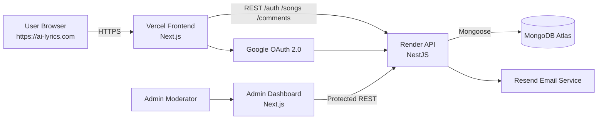
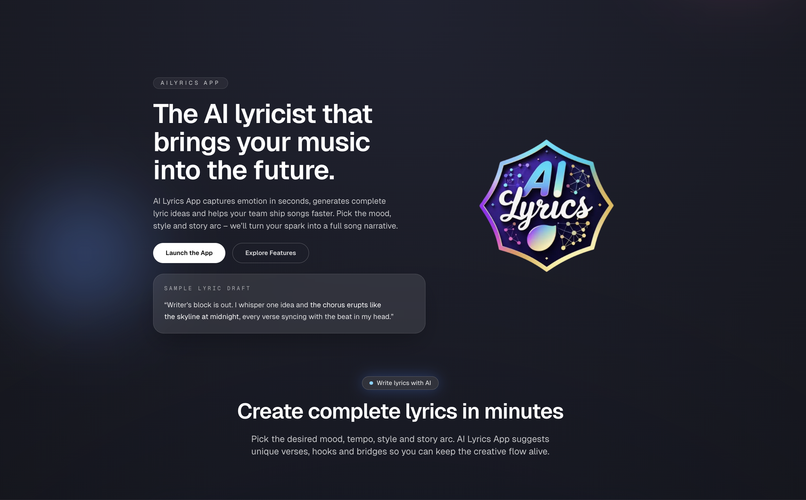
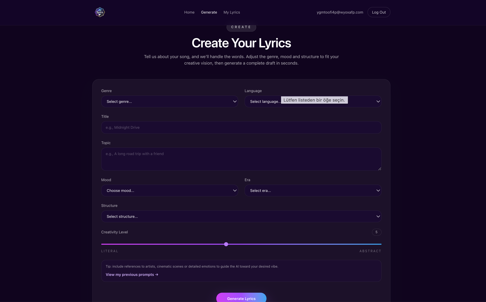
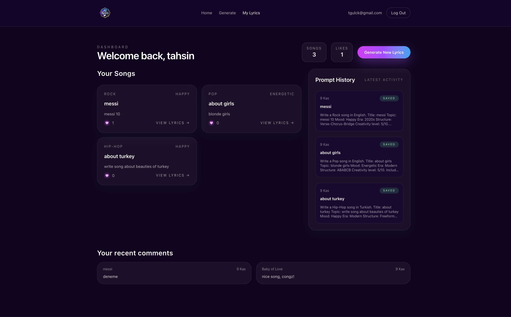
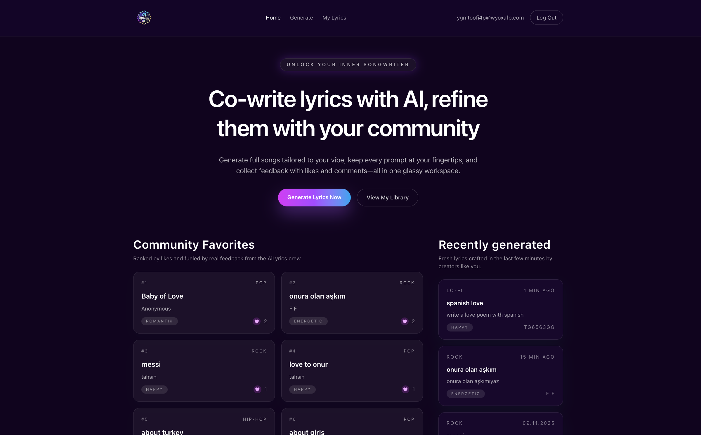
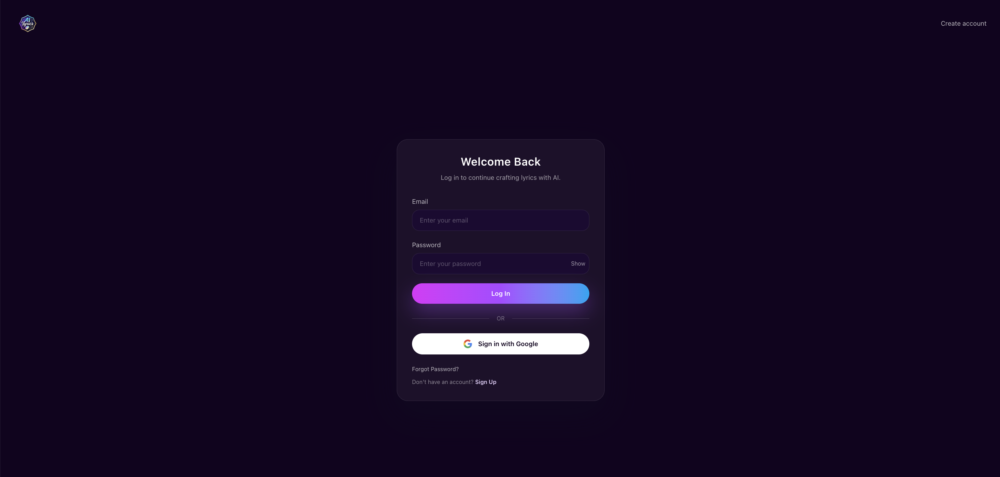
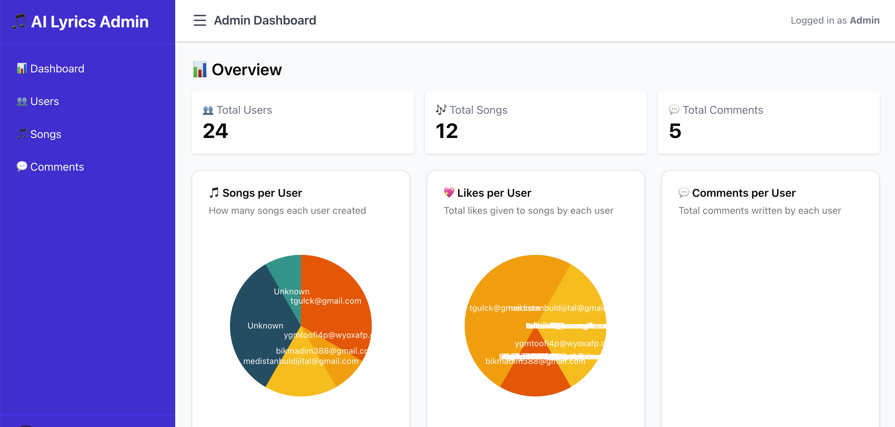
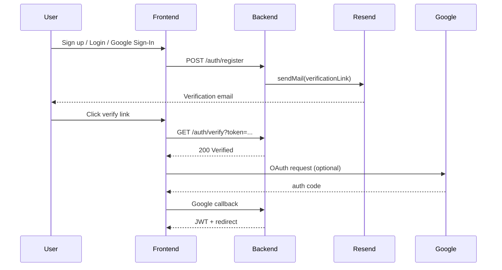

# AiLyrics Platform

AI-assisted songwriting platform with a Next.js user experience, NestJS API, and dedicated admin dashboard. The system generates lyrics with LLM prompts, lets listeners interact with songs, and provides team tools to monitor content.

---

## At a Glance

| Capability | Implementation | Notes |
| --- | --- | --- |
| Frontend | Next.js 14 (App Router) deployed on Vercel | `/frontend-new/ailyricsfront` |
| Backend API | NestJS + MongoDB Atlas deployed on Render | `/backend` |
| Admin Console | Next.js dashboard for moderators | `/ai-lyrics-admin` |
| Auth | JWT + Google OAuth 2.0 | Google “Sign in with” flow |
| Email | Resend transactional emails | Verification & password reset |

---

## Architecture



- **Cold starts** are mitigated with scheduled pings (UptimeRobot/Cronitor) hitting `https://ailyrics-app.onrender.com/api/health`.
- Render handles HTTPS termination and scales the NestJS container; Vercel serves edge-cached static assets plus SSR routes.

---

## Repository Layout

```
AiLyricsApp/
├── backend/                  # NestJS REST API
├── frontend-new/ailyricsfront/  # Next.js user-facing app
├── ai-lyrics-admin/          # Admin dashboard (Next.js)
├── scripts/                  # Utility scripts
└── README.md                 # You are here
```

---

## Screenshots

| Landing | Generator | Library |
| --- | --- | --- |
|  |  |  |

| Home Feed | Login | Admin Dashboard |
| --- | --- | --- |
|  |  |  |

---

## Core Features

- **Lyrics Generation** with configurable genre, mood, era, structure, creativity, and animated progress feedback while the LLM responds.
- **Interactive Song Feeds** including “Recently Generated” (real-time pagination) and “Top 10” ranking synced via API caching controls.
- **Rich Song Detail View** with live likes, comments, and removal of remix UI for clarity.
- **User Profile** showing generated songs, prompt history modal, and personal comment stream.
- **Email Verification & Password Recovery** handled via Resend with localized English content.
- **Google OAuth** integrated over secure redirect flow with production-ready domain handling.
- **Admin Console** for audits of users, songs, likes, and comments.

---

## Backend Overview (`/backend`)

| Module | Purpose |
| --- | --- |
| `src/auth` | JWT auth, Google OAuth callback handling, resend of verification links |
| `src/songs` | Generation, listing, popularity scoring, pagination & like toggling |
| `src/comments` | Song comments with user attribution |
| `src/prompts` | User prompt history and download |
| `src/email` | Resend-powered transactional mails |
| `src/main.ts` | Bootstrap & CORS setup (multi-origin aware) |

**Key endpoints**

- `POST /api/songs/generate` – generate new lyrics (requires JWT)
- `GET /api/songs` – paginated feed (`page`, `limit`)
- `GET /api/songs/popular` – top 10 likes snapshot
- `POST /api/songs/:id/like` – toggle like/unlike
- `POST /api/songs/:songId/comments` – add comment
- `POST /api/auth/login` / `POST /api/auth/register`
- `GET /api/auth/google` → OAuth redirect flow
- `POST /api/auth/forgot-password` & `POST /api/auth/reset-password`

---

## Frontend Overview (`/frontend-new/ailyricsfront`)

- **App Router** powered Next.js site with server & client components.
- **Realtime updates** via `fetch` options `cache: "no-store"` and `revalidate = 0`.
- **Suspense-wrapped auth screens** for `useSearchParams`.
- **UI** built with Tailwind CSS, Framer Motion animations, and bespoke design tokens.
- **Pagination** in `RecentlyGenerated` component with hydration-safe date formatting.

---

## Admin Dashboard (`/ai-lyrics-admin`)

- Next.js (App Router) app for moderators.
- Pages: `login`, `admin/users`, `admin/songs`.
- Uses the shared API client in `lib/api.ts` to call the Render backend with admin credentials.

---

## Local Development

### Prerequisites

- Node.js 18+
- npm (repo scripts assume npm; pnpm/yarn work with slight adjustments)
- MongoDB (local or Atlas cluster)
- Resend API key and Google OAuth credentials for full auth flow

### Environment Variables

Create `.env` files per package following `*.env.example` templates.

**Backend (`backend/.env`)**

```
MONGO_URI=mongodb+srv://...
JWT_SECRET=change-me
FRONTEND_URL=http://localhost:3005
API_BASE_URL=http://localhost:4000/api
RESEND_API_KEY=...
RESEND_FROM="AI Lyrics Team <no-reply@hello.ai-lyrics.com>"
GOOGLE_CLIENT_ID=...
GOOGLE_CLIENT_SECRET=...
GOOGLE_CALLBACK_URL=http://localhost:4000/api/auth/google/callback
OPENAI_API_KEY=... (if applicable for LLM provider)
```

**Frontend (`frontend-new/ailyricsfront/.env.local`)**

```
NEXT_PUBLIC_API_BASE_URL=http://localhost:4000/api
NEXT_PUBLIC_GOOGLE_CLIENT_ID=your-client-id.apps.googleusercontent.com
```

**Admin (`ai-lyrics-admin/.env.local`)**

```
NEXT_PUBLIC_API_BASE_URL=http://localhost:4000/api
```

### Run Everything Locally

```bash
# Backend
cd backend
npm install
npm run start:dev

# Frontend (new terminal)
cd ../frontend-new/ailyricsfront
npm install
npm run dev -- --port 3005

# Admin dashboard (optional)
cd ../ai-lyrics-admin
npm install
npm run dev -- --port 3006
```

- Frontend: `http://localhost:3005/app`
- Admin: `http://localhost:3006/login`
- API: `http://localhost:4000/api`

---

## Deployment Workflow

| Component | Platform | Trigger |
| --- | --- | --- |
| Frontend (`frontend-new/ailyricsfront`) | Vercel | Push to `main` |
| Backend (`backend`) | Render Web Service | Manual deploy or `git push` to connected repo |
| Admin Dashboard | (Optional) Vercel/Render/Self-host | Same as above |

**Pipeline Highlights**

1. Push to GitHub `main`.
2. Vercel automatically builds the Next.js app with environment secrets.
3. Render builds the NestJS API (`npm install --include=dev && npm run build`) and starts via `npm run start:prod`.
4. Resend and Google OAuth secrets configured in dashboard (no plaintext in repo).

---

## Email & Auth Flow



---

## Data Storage & Models

| Collection | Key Fields | Notes |
| --- | --- | --- |
| `users` | `email`, `username`, `password`, `isVerified`, `verificationToken`, `googleId` | Handles hybrid string/ObjectId migrations safely |
| `songs` | `title`, `lyrics`, `genre`, `createdBy`, `likeCount`, `prompt` | Aggregated for popular/top views |
| `comments` | `song`, `user`, `text`, `createdAt` | Exposed in profile and detail pages |
| `prompts` | `user`, `content`, `responseId`, `createdAt` | Displayed via profile modal |

---

## CORS & Domains

- Allowed origins derive from comma-separated `FRONTEND_URL` / `ADMIN_URL`.
- Google OAuth redirect uses the first declared origin to avoid malformed URLs.
- Production values:
  - Frontend: `https://ai-lyrics.com`
  - Backend: `https://ailyrics-app.onrender.com/api`
  - OAuth redirect: `https://ailyrics-app.onrender.com/api/auth/google/callback`

---

## Keeping the API Warm

Render free tier can sleep; schedule a ping every 5–10 minutes:

- UptimeRobot monitor → `https://ailyrics-app.onrender.com/api/health`
- Cronitor job hitting `/api/songs` during peak hours

---

## Testing & Quality

- Backend: `npm run test` / `npm run test:watch`
- Linting: `npm run lint` in each package
- Frontend: Rely on TypeScript + ESLint; add Playwright for E2E if needed.

---

## Contributing

1. Fork and create a feature branch.
2. Follow commit style (`feat: ...`, `fix: ...`).
3. Run lint/tests per package.
4. Submit PR with screenshots for UI changes.

---

## License

Private/internal project. Contact the AiLyrics team for usage inquiries.


